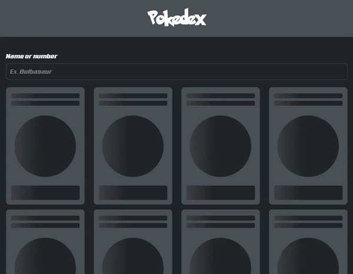

<p  align="center">
<a href="c">
		
	</a>
</p>

#

<p align="center">
  A fully responsive React application built with React consuming the public PokéApi.
</p>

<p align="center">
    <a href="https://github.com/matheusmhq/pokedex-react-js/blob/main/LICENSE" alt="license">
        
    </a>
</p>

<p align="center">
  <a href="#demo">Demo</a> •
  <a href="#libs">Libs</a> •
  <a href="#functionalities">Functionalities</a> •  
  <a href="#getting-started">Getting Started</a> 
</p>

<p align="center">
    
</p>

# Demo

[Pokedex ReactJs - Live ◀️](https://pokedex-up.netlify.app/)

## Libs

Key Libs used in this React project are:

| Lib             | Description   |
| :-------------:|--------------|
| [React](http://facebook.github.io/react/index.html) | A JavaScript library for building user interfaces. |
| [Bootstrap](https://react-bootstrap.github.io/) | The most popular front-end framework Rebuilt for React. |
| [Router Dom](https://reactrouter.com/) | The React Router Dom is a complete lib for route control. |
| [Axios](https://github.com/axios/axios) | Promise based HTTP client for the browser and node.js |

# Functionalities

- [Home (/)](https://pokedex-up.netlify.app/) - List **_pokemons_**, filter with base in name or number, has pagination.

- [Details (/details)](https://pokedex-up.netlify.app/details/bulbasaur) - Shows details (**_height, weight, abilities, stats, evolution etc..._**) about a specific pokemon.


# Getting Started

- Clone this repo

  ```
  git clone https://github.com/matheusmhq/pokedex-react-js.git

  cd pokedex-react-js
  ```

- Install all dependencies

  ```
  yarn install or npm install
  ```

- Now run **yarn start** or **npm start**

- Open your browser at `http://localhost:3000`

- Happy hacking! 😀😀😀
